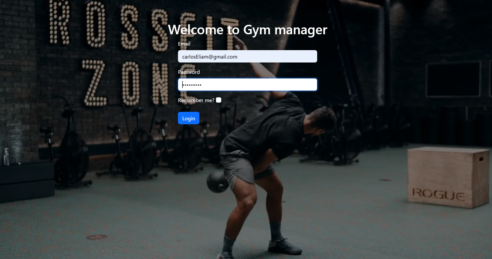
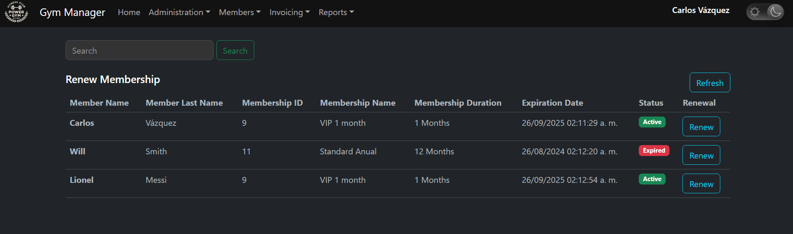
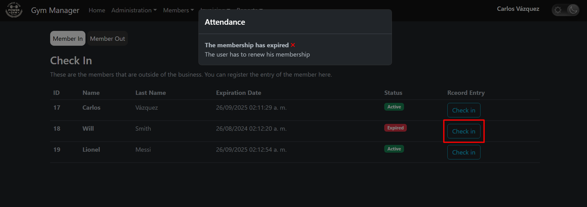
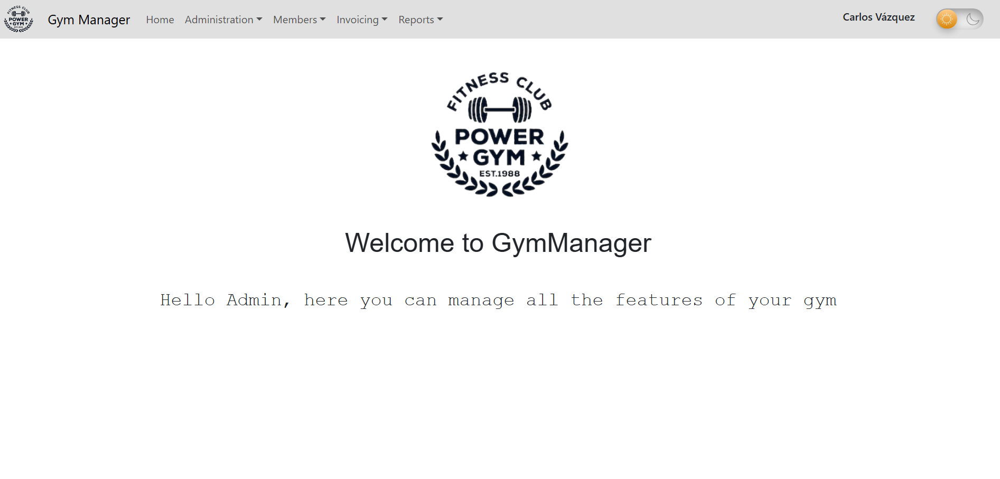
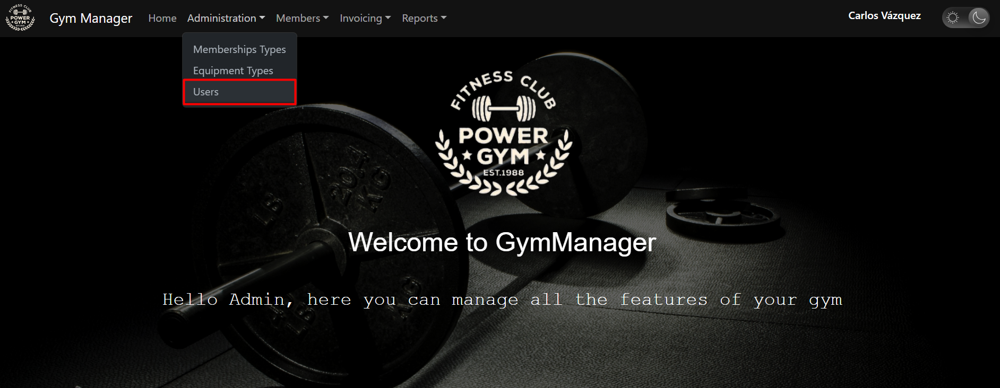

# 🏋️‍♂️ Gym Manager

This project is a **management system for public gyms**, developed in **MVC .NET Core** with **Entity Framework Core** and **MySQL**.  
Allow to manager members, memberships, access and more

---

## 📌 Features

### Login
 

### Member register and managment

- Create Member
 

- Member List
 

### Memberships control (Active/Expired)

- Membership control list
 

- Renew membership (You can select the new membership and you will se the new expiration date)
 

### Attendance management (Check in/Check Out)

- Attendance panel
 

- When a User with a EXPIRED membership try to check in... the system will not register and suggest renew the membership
 

- But when a user with an ACTIVE membership try to check in... the systems will register the attendance 
 

### Reports (Prototype)

-HTML Reports
 

 

- PDF Reports
 

 

### Dark/Light mode switch
- Dark mode
 

- Light mode
 

### Other CRUDS

- Membership Types List

- Equipment Types List
 

---

## ⚙️ Tecnologhies used

- [.NET 6/7](https://dotnet.microsoft.com/)
- [Entity Framework Core](https://learn.microsoft.com/ef/core/)
- [MySQL](https://www.mysql.com/)

---

## 🚀 Instalation and execution

### Create a database in your MYSQL local enviroment

### Clone the repsoitory, then, enter to GymManager.Web.sln file

### In Visual Studio, go to GymManager.Web project and modifiy the string connection in the appsettings.json file, replacing your database name and MYSQL credentials

### Be sure you had the GymManager.Web like the default project. 

### Open the Package Manager Console and select GymManager.DataAccess like default project
 

### Run the next Command:
 

### The database migration has been applied successfully !
 

### Now you cant test the App. Click on the Play green button

### You will see the login page. 
You can use the next credentials:
username: carlosEliam@gmail.com (This is not my email, it's just a random email, it's not verified)
 
 
password: Tacos123*

 

### The default account is in the Account Controller. You can change the default account
 

### Inside of the App, you can create new users
 

 

## 📜 License
## 📜 License
This project is under MIT License
Free to use, modify and distribute

## 👨‍💻 Autor
## 👨‍💻 Autor
Carlos Vázquez
Email: carloseliamvazquez@gmail.com
